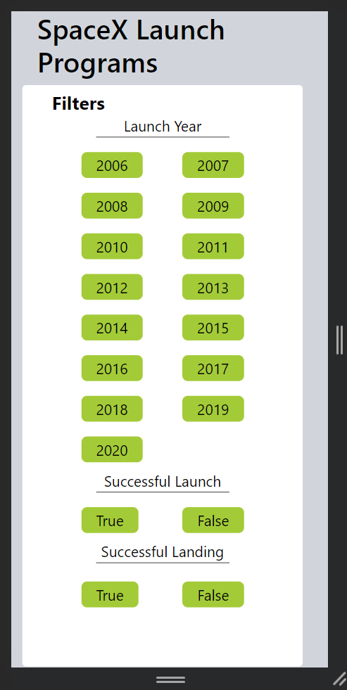
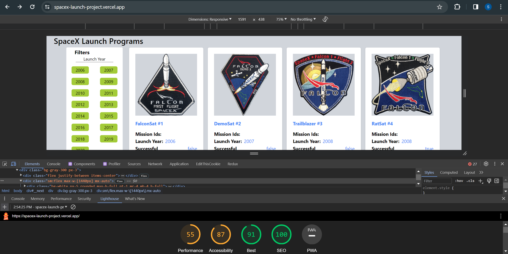

# SpaceX Launch finder task
Live demo https://spacex-launch-project.vercel.app/

## Table of Contents

- [Installation](#installation)
- [Technologies Used](#technologies-used)
- [Preview](#previews)

## Installation

1.  Clone the repository:

    ```bash
    git clone <repository-url>
    cd spacex-launch-project
    ```

2.  Install dependencies:

    ```
    npm install

    ```

3.  Start the development server:

    ```
    npm run dev
    ```

4.  Launch the app :

    ```
    ctrl+click on the localhost:3000
    ```

## Technologies Used

- Frontend: Next.js, React.js, TailwindCss

## Previews

1. At screen width under 700
   

2. At screen width under 700+1024
   

3. At screen width 1440
   

4. Phone view
   

5. Phone view
   

6. Phone view
   
